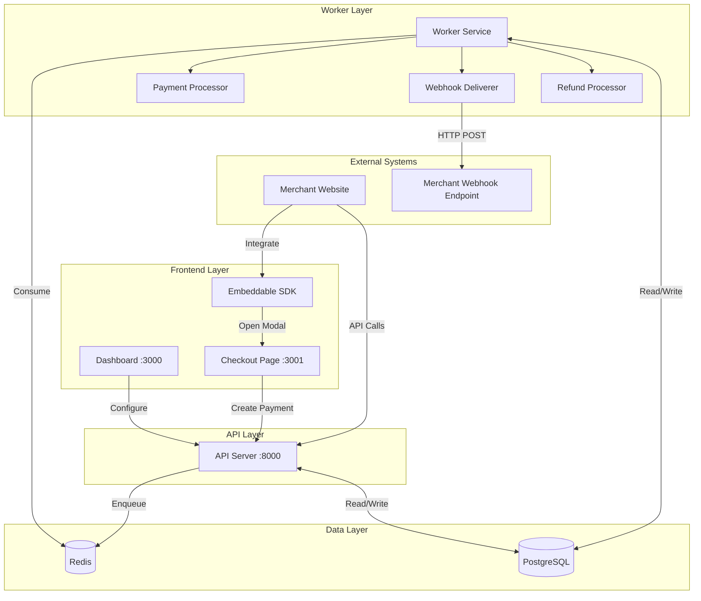
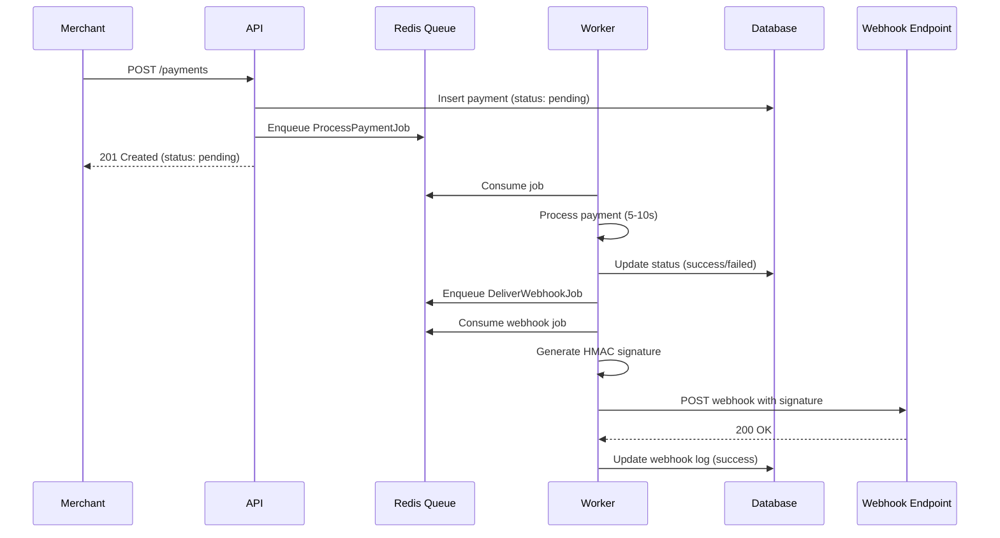
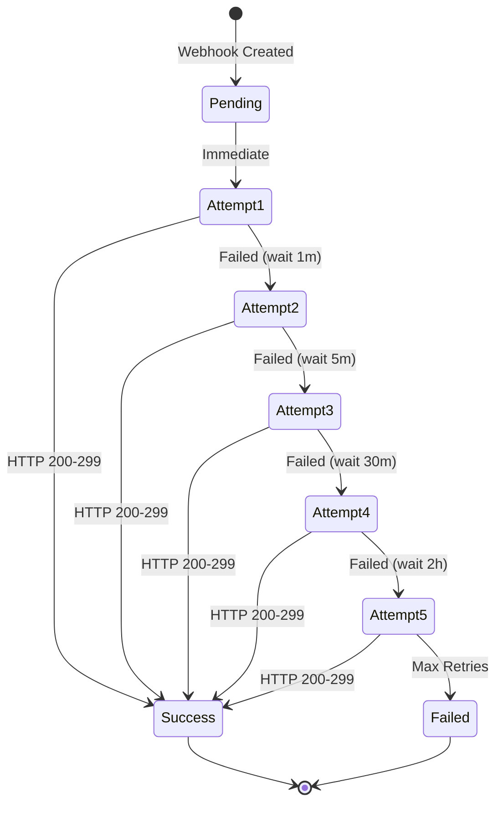
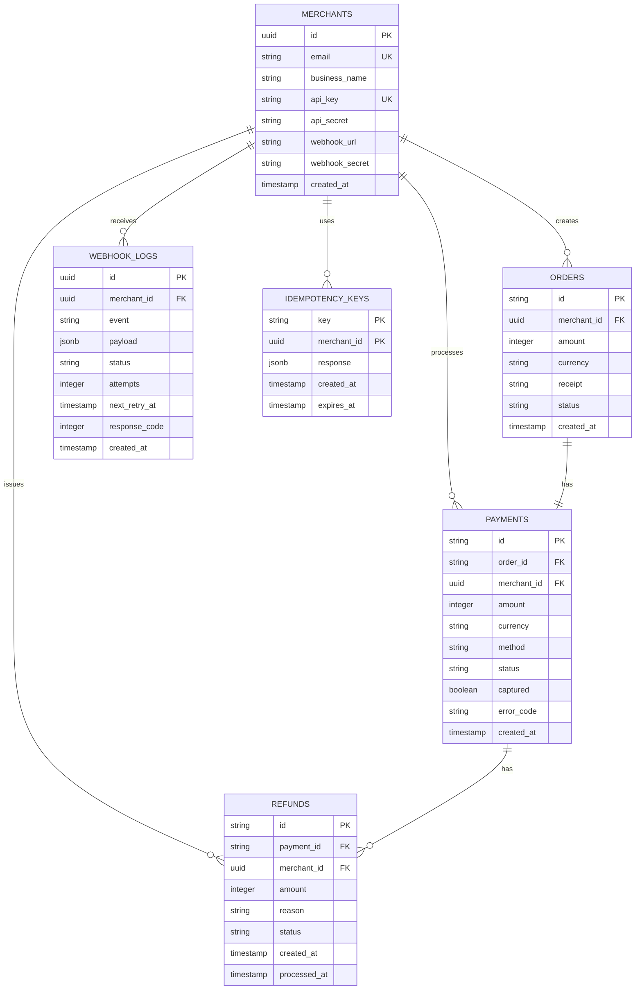

# Payment Gateway Architecture

## System Overview

The payment gateway is built on a microservices architecture with async job processing, enabling scalability and reliability for production workloads.

## Architecture Diagram

## Async Processing Flow

## Webhook Retry Mechanism

## Database Schema

## Component Responsibilities

### API Server
- Handle HTTP requests
- Authenticate merchants
- Validate input data
- Enqueue background jobs
- Return immediate responses

### Worker Service
- Process payment jobs
- Deliver webhooks with retries
- Process refunds
- Update database records
- Handle job failures

### Redis Queue
- Store pending jobs
- Enable async processing
- Provide job retry mechanism
- Track job status

### PostgreSQL
- Persist all data
- Maintain data integrity
- Support transactions
- Enable complex queries

## Security Considerations

### API Authentication
- API key + secret validation
- Scoped to merchant account
- No public endpoints (except test)

### Webhook Security
- HMAC-SHA256 signatures
- Prevents tampering
- Verifiable by merchant
- Unique secret per merchant

### Idempotency
- Prevents duplicate charges
- 24-hour key expiration
- Scoped to merchant
- Cached responses

## Scalability Patterns

### Horizontal Scaling
- Multiple API instances behind load balancer
- Multiple worker instances processing jobs
- Redis cluster for high throughput
- PostgreSQL read replicas

### Job Queue Benefits
- Decouples processing from API
- Handles traffic spikes
- Automatic retries
- Failure isolation

### Database Optimization
- Indexed foreign keys
- Partial indexes on status
- Connection pooling
- Query optimization

## Monitoring & Observability

### Key Metrics
- Payment success rate
- Webhook delivery rate
- Job processing time
- Queue depth
- API response time

### Logging
- Structured JSON logs
- Request/response logging
- Job execution logs
- Error tracking

### Health Checks
- API health endpoint
- Database connectivity
- Redis connectivity
- Worker status

## Deployment Strategy

### Docker Compose (Development)
- Single-host deployment
- Easy local testing
- Quick iteration

### Kubernetes (Production)
- Multi-host deployment
- Auto-scaling
- Rolling updates
- High availability

### CI/CD Pipeline
1. Run tests
2. Build Docker images
3. Push to registry
4. Deploy to staging
5. Run integration tests
6. Deploy to production

## Future Enhancements

- [ ] Payment method plugins
- [ ] Multi-currency support
- [ ] Fraud detection
- [ ] Analytics dashboard
- [ ] Rate limiting
- [ ] API versioning
- [ ] Webhook replay
- [ ] Subscription billing
