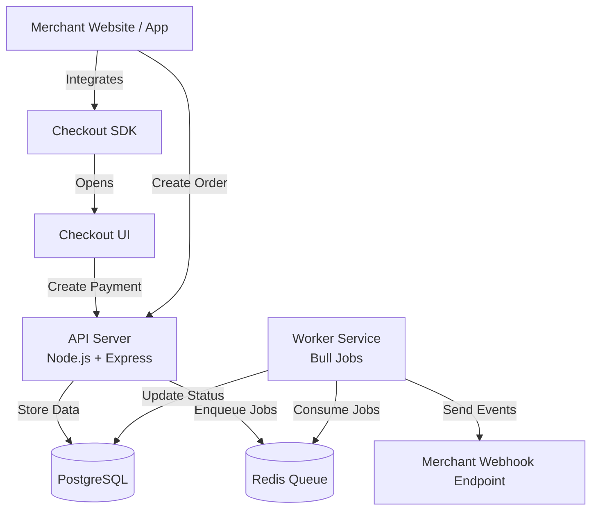
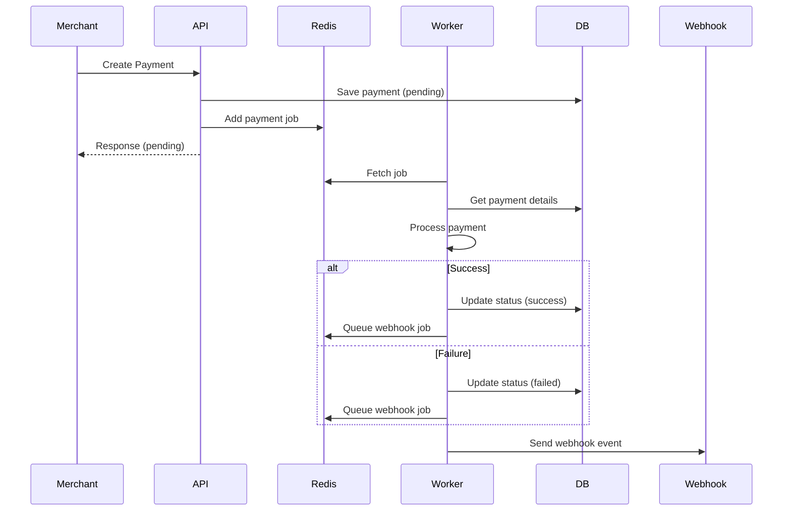
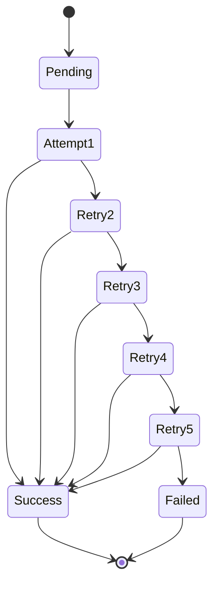
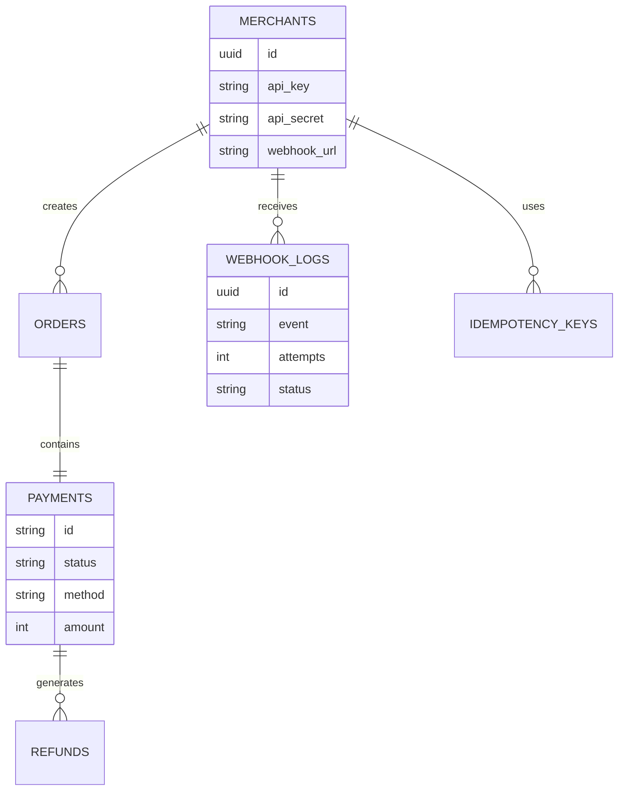

# 🏗️ System Architecture

This document explains the **overall architecture** of the Async Payment Gateway system.  
The design follows **real-world payment gateway patterns** used in production systems.

---

## 📌 Architecture Goals

- Non-blocking payment processing
- High scalability using background workers
- Reliable webhook delivery
- Clear separation of responsibilities
- Easy monitoring and maintenance

---

## 🧱 High-Level Architecture Diagram

## 🔄 Payment Processing Flow

## Webhook Delivery Architecture

## Data Architecture

## 🧠 Component Responsibilities
## API Server

Authentication

Input validation

Order & payment creation

Job enqueueing

Status APIs

### Worker Service

Payment processing

Refund processing

Webhook delivery

Retry handling

 ## Redis

Job queue storage

Retry scheduling

Worker coordination

## PostgreSQL

Persistent storage

Audit logs

Payment lifecycle tracking

## Checkout SDK

Modal handling

Iframe communication

Success / failure callbacks

⚙️ Why This Architecture Works

✔ API remains fast and responsive
✔ Long tasks handled asynchronously
✔ Failures are retried safely
✔ Services can scale independently
✔ Matches real payment gateway systems

🎯 Summary

This architecture is designed to handle real-world payment workloads, not demo traffic.
It emphasizes reliability, scalability, and security, making it suitable for production-style environments.

